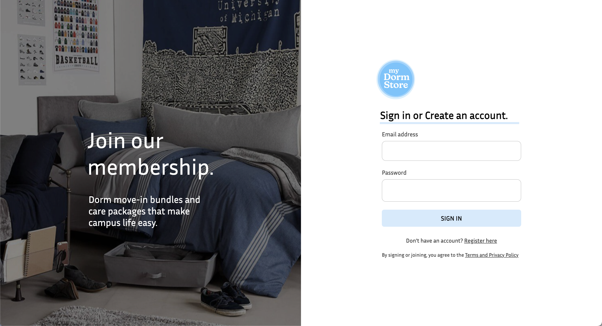
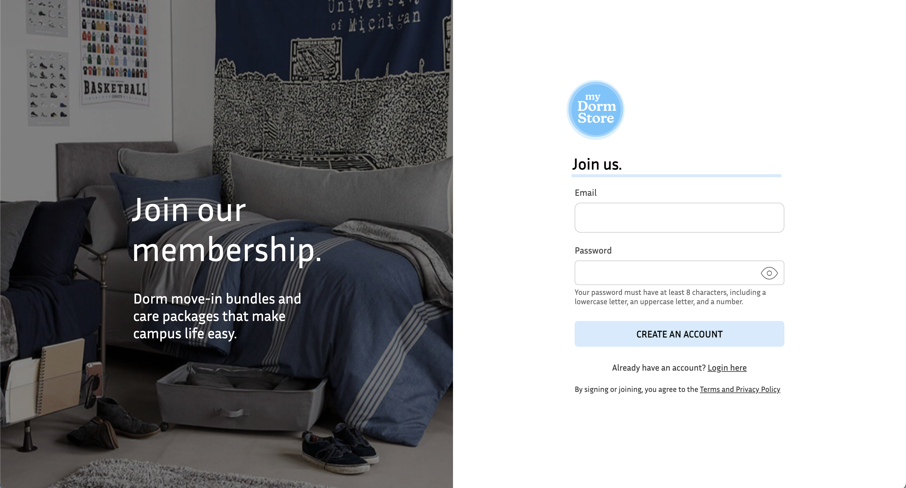
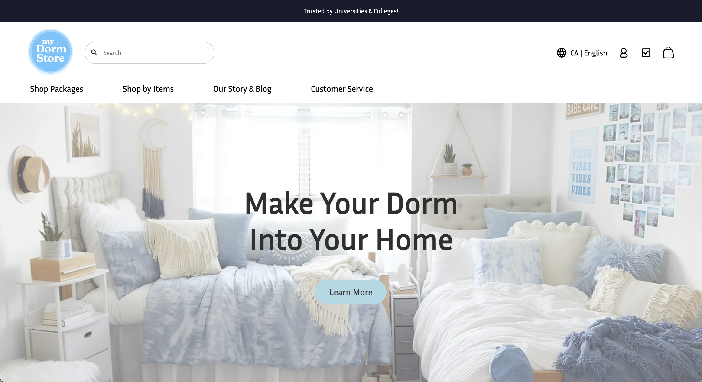
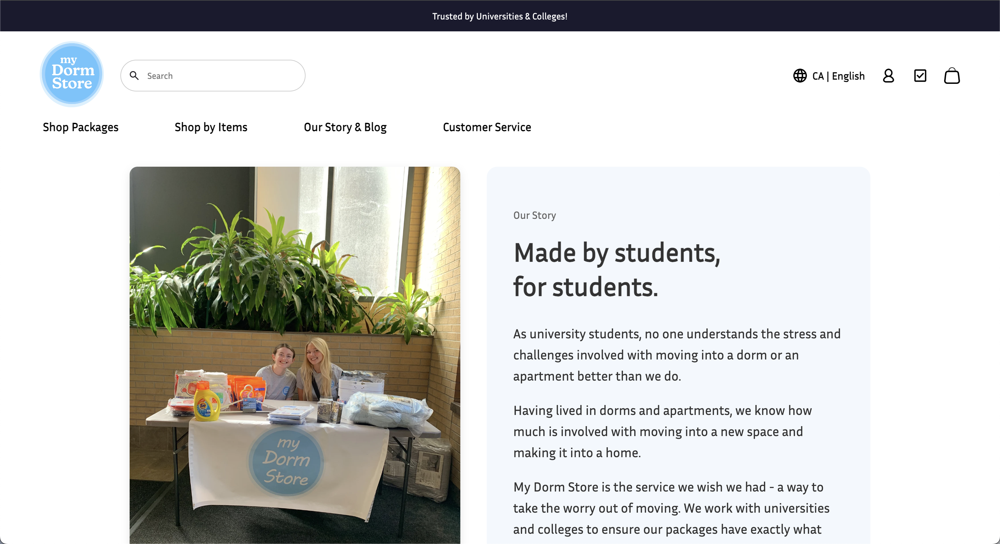
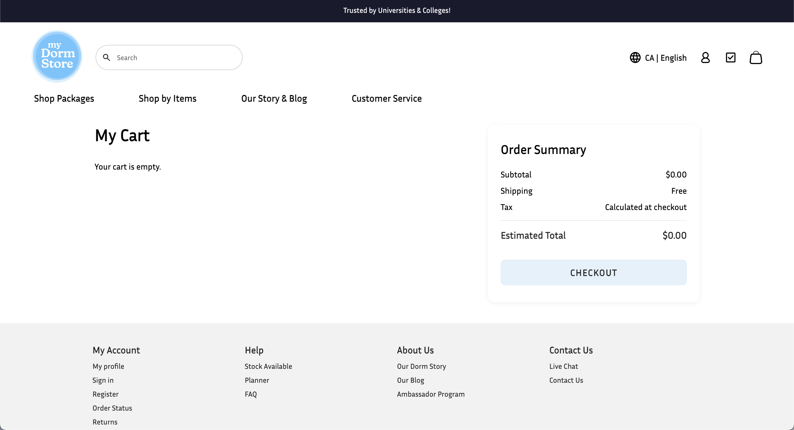
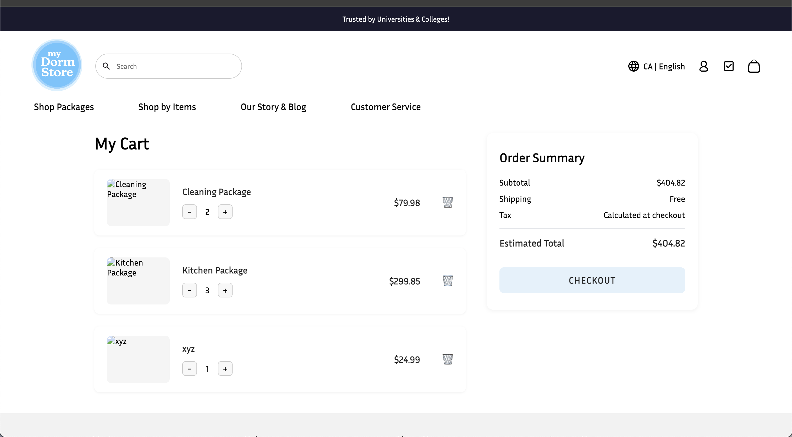

# term-group-project-c01s25-project-my-dormstore

 > _Note:_ This document is meant to be written during (or shortly after) your review meeting, which should happen fairly close to the due date.      
 >      
 > _Suggestion:_ Have your review meeting a day or two before the due date. This way you will have some time to go over (and edit) this document, and all team members should have a chance to make their contribution.

## Iteration 01 - Review & Retrospect

 * When: June 15, 2025
 * Where: Online (Discord)

## Process - Reflection

(Optional) Short introduction

#### Decisions that turned out well

List process-related (i.e. team organization) decisions that, in retrospect, turned out to be successful.

 * 2 - 4 decisions.
 * Ordered from most to least important.
 * Explain why (i.e. give a supporting argument) you consider a decision to be successful.
 * Feel free to refer/link to process artifact(s).

#### Decisions that did not turn out as well as we hoped

1. **Insufficient time allocated for resolving merge conflicts**  
Several merge conflicts occurred toward the end of the sprint due to overlapping work and last-minute merges, slowing integration.

2. **Delayed planning of cart state management**  
We didn’t allocate enough time for planning how to manage cart state globally, resulting in inconsistent or conflicting cart behavior.

#### Planned changes

1. **Improve merge coordination and PR timing**  
We'll implement a stricter PR deadline (e.g., no merges 24 hrs before sprint deadline) to allow time for reviews and conflict resolution.

2. **

## Product - Review

#### Goals and/or tasks that were met/completed:

- **User Authentication**  

  Implemented and tested login/register functionality using JWT for authentication. `/me` endpoint confirms session handling.

  

  

- **Frontend Framework Setup**  

  Core UI structure built using React. Layout is responsive and reusable components like `TopBar`, `NavBar`, and `Footer` are functioning.

  

  

- **Basic Cart Functionality**  

  Users can add and remove items from the cart. Cart state is managed using context and properly reflected in the UI.

  

  

#### Goals and/or tasks that were planned but not met/completed:

 * From most to least important.
 * For each goal/task, explain why it was not met/completed.      
   e.g. Did you change your mind, or did you just not get to it yet?

## Meeting Highlights

Going into the next iteration, our main insights are:

 * 2 - 4 items
 * Short (no more than one short paragraph per item)
 * High-level concepts that should guide your work for the next iteration.
 * These concepts should help you decide on where to focus your efforts.
 * Can be related to product and/or process.

