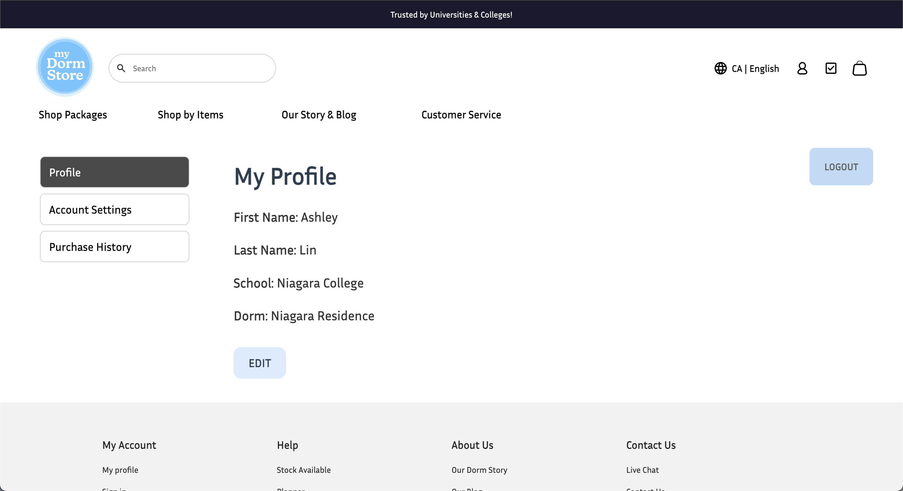
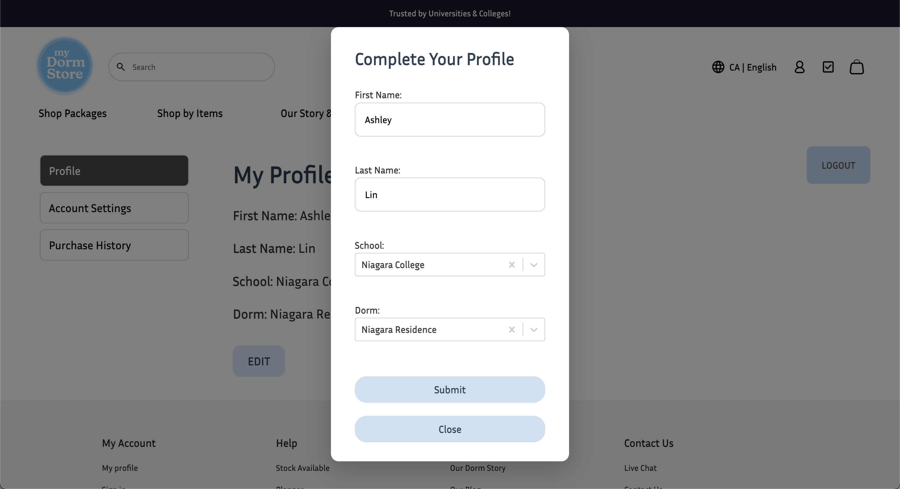
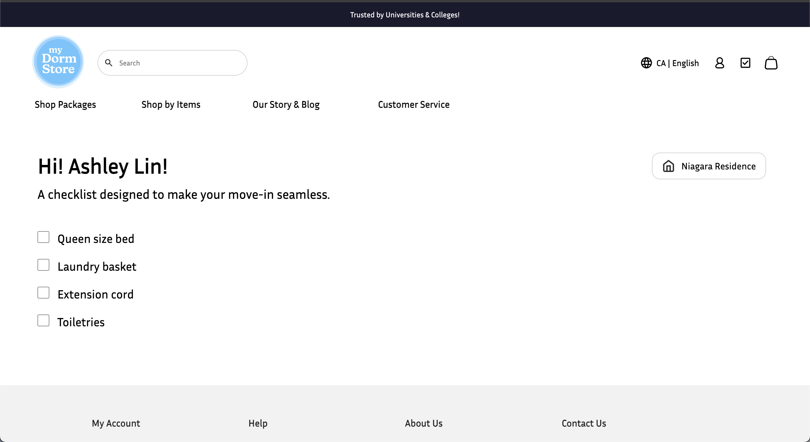
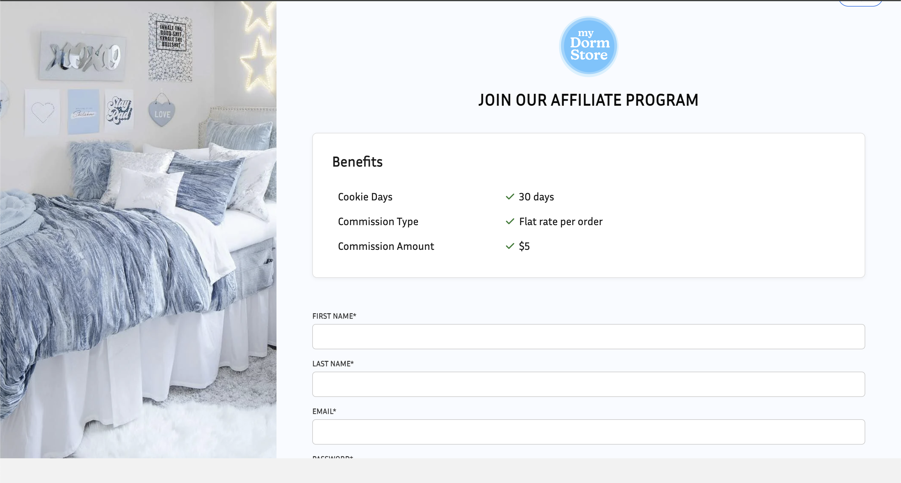
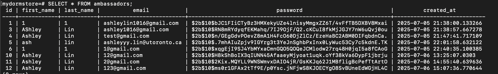
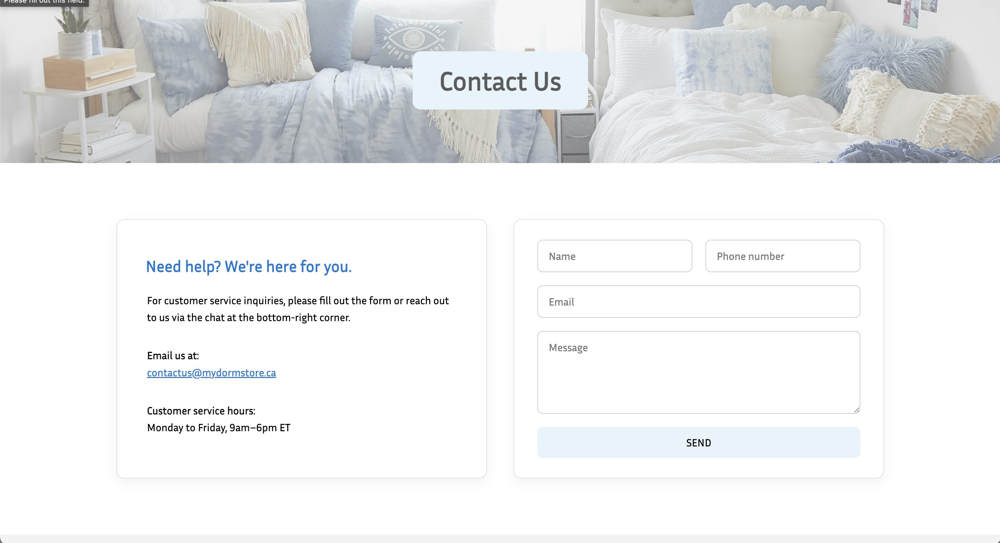
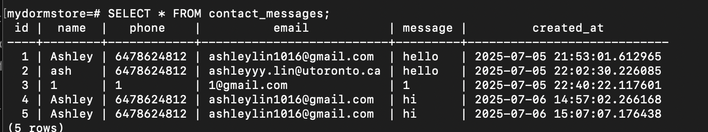

# term-group-project-c01s25-project-my-dormstore

 > _Note:_ This document is meant to be written during (or shortly after) your review meeting, which should happen fairly close to the due date.      
 >      
 > _Suggestion:_ Have your review meeting a day or two before the due date. This way you will have some time to go over (and edit) this document, and all team members should have a chance to make their contribution.

## Iteration 2 - Review & Retrospect

 * When: July 8th, 2025
 * Where: Online (Discord)

## Process - Reflection

Our team continued to use a mix of virtual and in-person meetings during this sprint as we focused on building the core features of our dorm store web app. While we faced some technical challenges—particularly around integration and cart state management—we made strong progress on authentication, layout, and cart functionality.

Compared to the previous sprint, our collaboration improved significantly. Although the absence of one group member initially posed a challenge, the rest of the team quickly aligned, redistributed the missing tasks efficiently, and ultimately delivered great results.

#### Decisions that turned out well

- **Component-based front-end development**
In Sprint 2, we decided to complete both the backend and frontend functionalities, ensuring that all features, including buttons across the website work properly. This full integration approach allowed us to deliver a more complete and interactive user experience while maintaining a consistent and scalable front-end structure.

- **Combining virtual and in-person meetings**  
We continued to hold a mix of virtual and in-person meetings. This hybrid approach gave us flexibility while maintaining strong productivity. In-person sessions were particularly effective for debugging and integration, while virtual stand-ups ensured consistent coordination.

- **Prioritize early integration to reduce merge conflicts**  
We successfully completed all tasks except those assigned to the missing group member. We merged all remaining work, committed the final functionalities to GitHub, and delivered a complete demo presentation.

#### Decisions that did not turn out as well as we hoped

- **Delayed planning of **  

  We didn’t allocate enough time for planning how to manage cart state globally, resulting in inconsistent or conflicting cart behavior.

#### Planned changes

- **Improve merge coordination and PR timing**
  
  Although our merging process went smoothly this time, we plan to implement a stricter pull request (PR) deadline, such as no merges within 24 hours of the sprint deadline to allow sufficient time for code reviews and conflict resolution.

- **Clear Task Ownership and Prioritization**

  Each task will have a designated owner and a priority label (e.g., High, Medium, Low) to improve accountability and help the team focus on the most   critical items first.

## Product - Review

#### Goals and/or tasks that were met/completed:

- **Developed and integrated the Personalization Form**

- **Implemented the Interactive Checklist**

- **Built the Profile and Account Settings Pages**

- **Connected the backend of the ambassador's program with the frontend**

- **Built both the frontend and backend of the contactus page**

#### Goals and/or tasks that were planned but not met/completed:

- **Admin Dashboard**

  Initially planned to create a dashboard for administrators to view user form submissions and track order data, but was deprioritized due to time      constraints and focus on user-facing features.

- **Payment Processing Integration**

  Planned to begin integration with a payment gateway; however, this was postponed to a future sprint to prioritize checklist personalization,   account management, and order tracking.

- **Mobile Responsiveness Improvements**

  While some UI components were tested on smaller screens, full mobile optimization was not completed and will be addressed in a future design- 
  focused sprint.

## Meeting Highlights

Going into the next iteration, our main insights are:

- **Prioritize early integration to reduce merge conflicts**  
  Waiting until the final days to merge major branches created avoidable conflicts. Next sprint we’ll encourage smaller, more frequent merges into `develop`.

- **Establish shared understanding of global state early**  
  Misalignment on cart state management delayed progress. We’ll begin the sprint with a brief planning session to define our state structure and ownership.

- **Time-box individual features more strictly**  
  Several tasks exceeded their estimates and disrupted overall sprint pacing. We’ll scope work more realistically and trim scope if necessary to finish on time.

