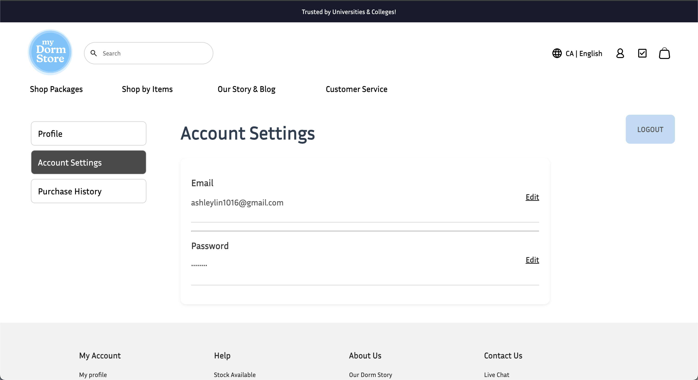

# term-group-project-c01s25-project-my-dormstore

 > _Note:_ This document is meant to be written during (or shortly after) your review meeting, which should happen fairly close to the due date.      
 >      
 > _Suggestion:_ Have your review meeting a day or two before the due date. This way you will have some time to go over (and edit) this document, and all team members should have a chance to make their contribution.

## Iteration 2 - Review & Retrospect

 * When: June 15, 2025
 * Where: Online (Discord)

## Process - Reflection

Our team did a combination of virtual and physical meet for this sprint and continued building the core features of our dorm store web app. While we encountered some technical challenges, mainly around integration and cart state management, we made solid progress on authentication, layout, and cart features. We also improved our collaboration flow compared to the previous sprint.

#### Decisions that turned out well

1.  **Component-based front-end development**  
Focusing on building and testing reusable UI components (e.g., `TopBar`, `NavBar`, `Footer`) allowed us to work more efficiently and maintain a consistent design system. This decision reduced rework and improved front-end scalability.

2. **Combining virtual and in-person meetings**  
Mixing remote and in-person meetings gave us flexibility while maintaining productivity. In-person work sessions were especially effective for debugging and integration, while virtual stand-ups helped with regular coordination.

#### Decisions that did not turn out as well as we hoped

1. **Insufficient time allocated for resolving merge conflicts**  

Several merge conflicts occurred toward the end of the sprint due to overlapping work and last-minute merges, slowing integration.

2. **Delayed planning of cart state management**  

We didn’t allocate enough time for planning how to manage cart state globally, resulting in inconsistent or conflicting cart behavior.

#### Planned changes

1. **Improve merge coordination and PR timing**  

We'll implement a stricter PR deadline (e.g., no merges 24 hrs before sprint deadline) to allow time for reviews and conflict resolution.

2. **Clear Task Ownership and Prioritization**

Each task will have a designated owner and a priority label (e.g., High, Medium, Low) to improve accountability and help the team focus on the most critical items first.

## Product - Review

#### Goals and/or tasks that were met/completed:

- **Developed and integrated the Personalization Form**

- **Implemented the Interactive Checklist**

- **Built the Profile and Account Settings Pages**

- **Connected the backend of the ambassador's program with the frontend**

- **Built both the frontend and backend of the contactus page**

#### Goals and/or tasks that were planned but not met/completed:

- **Check-out Page**  

We planned to implement the user check-out page during this sprint, but it was delayed due to merge conflicts when integrating into the `develop` branch. Although we attempted to address it, we didn’t have enough time to finish and test it properly. Completing this feature will be a priority in the next sprint.

## Meeting Highlights

Going into the next iteration, our main insights are:

- **Prioritize early integration to reduce merge conflicts**  
  Waiting until the final days to merge major branches created avoidable conflicts. Next sprint we’ll encourage smaller, more frequent merges into `develop`.

- **Establish shared understanding of global state early**  
  Misalignment on cart state management delayed progress. We’ll begin the sprint with a brief planning session to define our state structure and ownership.

- **Time-box individual features more strictly**  
  Several tasks exceeded their estimates and disrupted overall sprint pacing. We’ll scope work more realistically and trim scope if necessary to finish on time.

