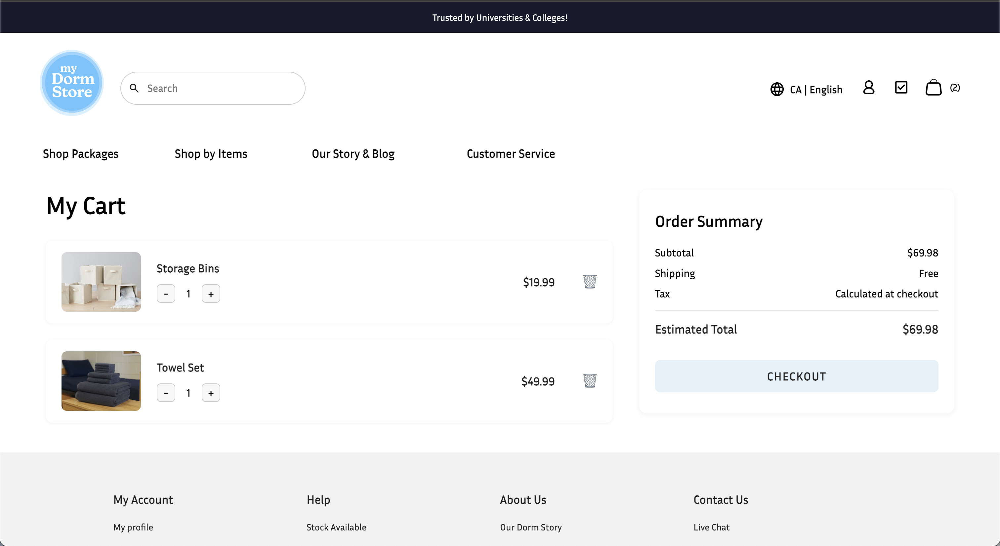
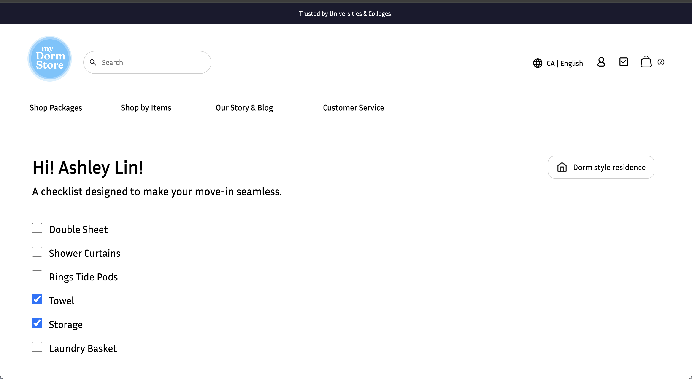
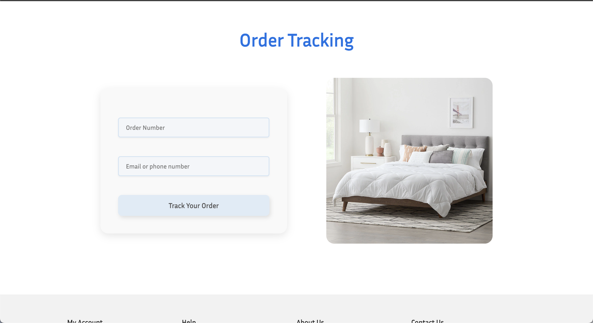
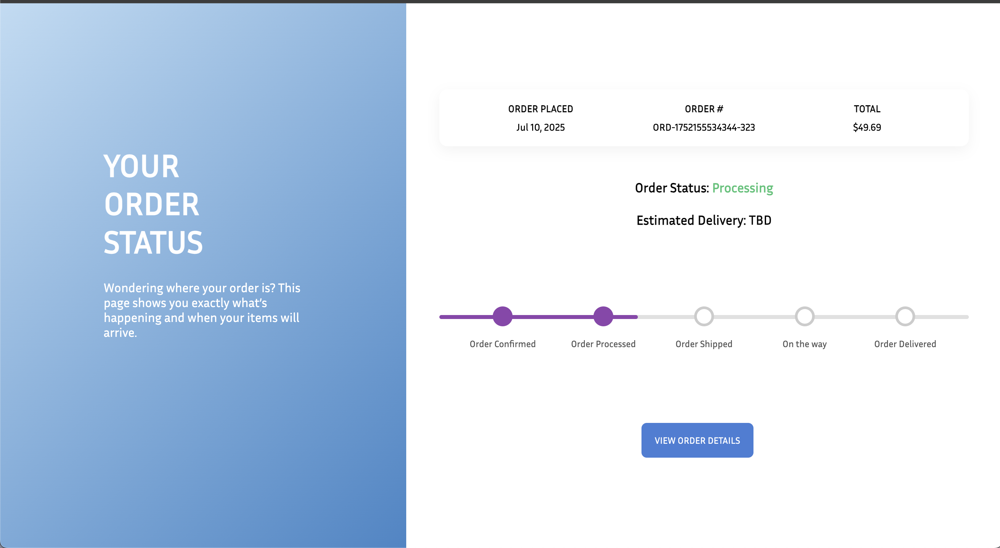
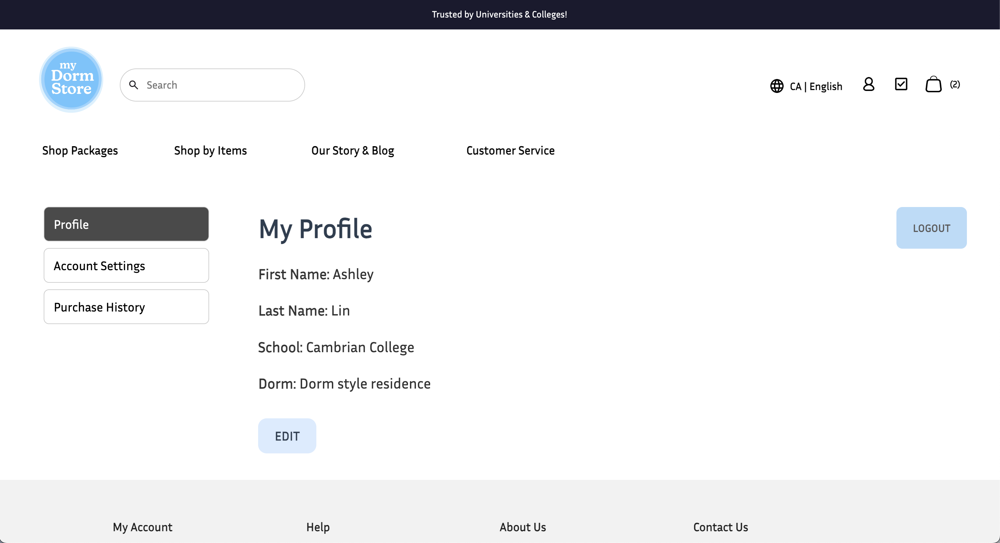
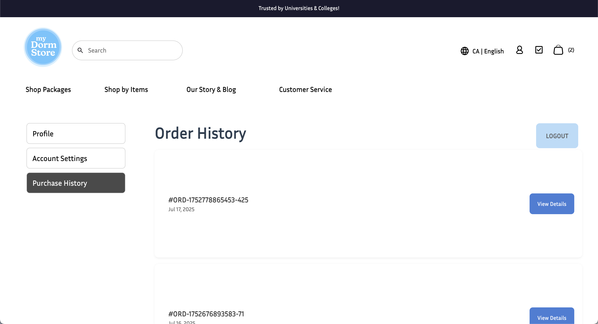
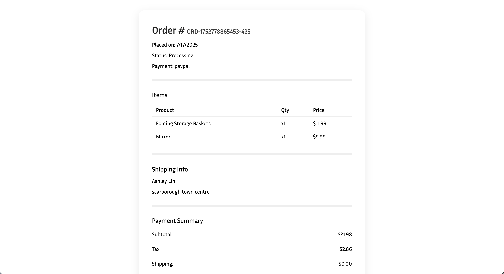

# term-group-project-c01s25-project-my-dormstore

 > _Note:_ This document is meant to be written during (or shortly after) your review meeting, which should happen fairly close to the due date.      
 >      
 > _Suggestion:_ Have your review meeting a day or two before the due date. This way you will have some time to go over (and edit) this document, and all team members should have a chance to make their contribution.

## Iteration 3 - Review & Retrospect

 * When: July 19th, 2025
 * Where: Online (Discord)

## Process - Reflection

During Sprint 3, our team maintained consistent collaboration and made significant improvements in both user experience and backend functionality. Our workflow benefited from the clearer task ownership established last sprint, and we adhered more closely to our mid-sprint integration checkpoints. This resulted in fewer merge conflicts and a more stable develop branch throughout.

One challenge was testing coordination—while some team members started implementing unit tests, our coverage varied across components. Additionally, final integrations and styling still concentrated toward the end of the sprint, which compressed QA and polishing time. We aim to smooth this out in Sprint 4 by integrating visual/UI work earlier.

#### Decisions that turned out well

- **Dorm Checklist Auto-Check Integration**
We implemented a feature that automatically checks off items in the dorm checklist when users add matching products to their cart. This creates a seamless planning experience without requiring users to track manually.

- **Purchase History View in Profile**
Users can now view their past orders, including order dates and product details. This boosts transparency and offers a basic order archive for reference.

- **Order Tracking via Order Number and Email**
Even non-logged-in users can now track their orders using just their order number and email. This opens up flexible access to order status updates without account friction.

#### Decisions that did not turn out as well as we hoped

- We are still in the process of determining the best approach for implementing the cart checkout logic, particularly around residence-based validation and cart content re-evaluation. This caused inconsistent behaviors, such as mismatch between shipping cost and selected residence, and occasional bugs when switching residences mid-checkout.

  Additionally, while we completed all 14 work items in this sprint, we deprioritized mobile screen optimization, which has impacted the mobile usability of several key pages (e.g., profile, admin dashboard, and order summary).

#### Planned changes

- **Enforce PR Deadlines**
  
  Although our merging process was smoother than previous sprints, we will implement a stricter pull request policy—no PRs merged within 24 hours of the sprint deadline—to improve code quality and allow time for full team reviews.

- **Assign Task Owners and Priorities**

  To enhance accountability and ensure focus on the most impactful features, we will assign a clear owner and priority level (High, Medium, Low) to   each task going forward.

## Product - Review

#### Goals and/or tasks that were met/completed:

- **Dorm Checklist Auto-Check (SCRUM-37)**

- **Order Status Page with Tracking (SCRUM-35, SCRUM-39)**

- **Purchase History in Profile (SCRUM-38)**

- **add more**

- **add more**

- **add more**

#### Goals and/or tasks that were planned but not met/completed:

- **change**

  Initially planned to create a dashboard for administrators to view user form submissions and track order data, but was deprioritized due to time      constraints and focus on user-facing features.

- **change**

  Planned to begin integration with a payment gateway; however, this was postponed to a future sprint to prioritize checklist personalization,   account management, and order tracking.

- **change**

  While some UI components were tested on smaller screens, full mobile optimization was not completed and will be addressed in a future design- 
  focused sprint.

## Meeting Highlights

Going into the next iteration, our main insights are:

- **Align early on shared components to prevent duplication**
Several components (e.g., status indicators, modals) were reimplemented or styled inconsistently—next sprint we’ll coordinate shared visual components earlier.

- **Set a consistent pattern for unit testing structure**
We'll standardize test folder locations and frameworks used (e.g., Jest for frontend, Mocha or Jest for backend) so each dev knows where and how to test.

- **Avoid last-minute merges and styling**
While our logic is often done early, styling and integration still happen late. We'll prioritize visual integration checkpoints before the final few days.

