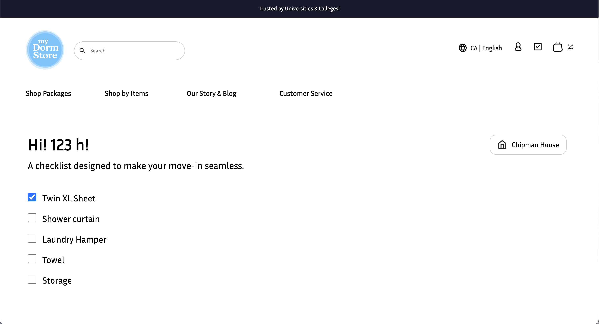
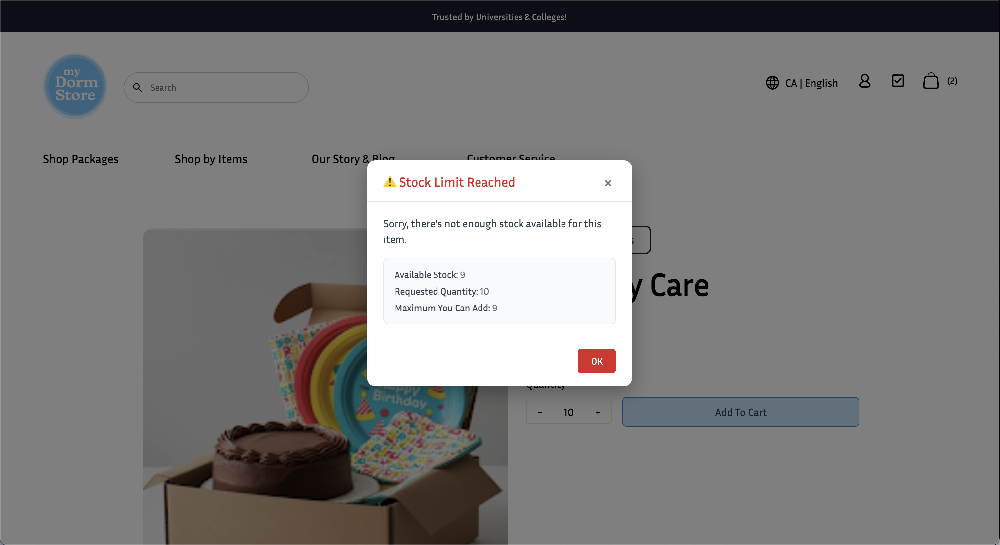
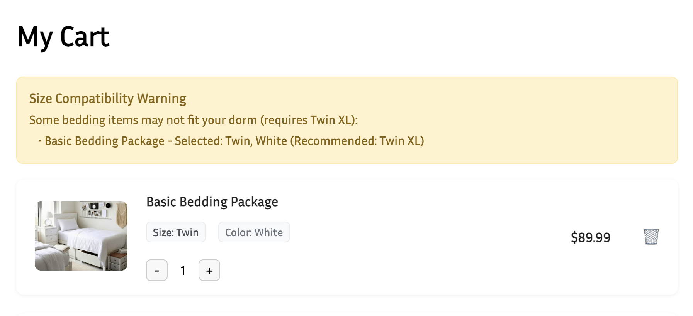
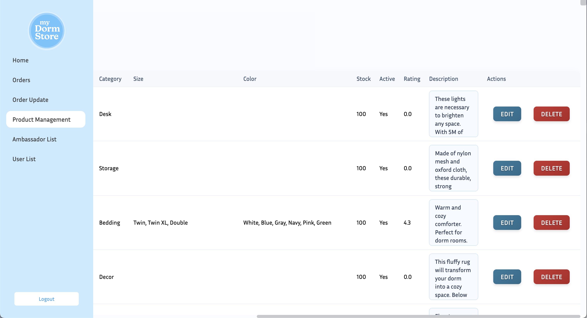

# term-group-project-c01s25-project-my-dormstore

 > _Note:_ This document is meant to be written during (or shortly after) your review meeting, which should happen fairly close to the due date.      
 >      
 > _Suggestion:_ Have your review meeting a day or two before the due date. This way you will have some time to go over (and edit) this document, and all team members should have a chance to make their contribution.

## Iteration 4 - Review & Retrospect

 * When: Aug 3rd, 2025
 * Where: Online (Discord)

## Process - Reflection

In Sprint 4, our team focused heavily on finalizing and polishing features to ensure a stable MVP for demo and submission. We benefited from clearer task prioritization and continued strong collaboration via Discord and GitHub. Improvements in test coverage and CI/CD integration helped us catch bugs earlier, contributing to a more stable development environment.

That said, there were still moments of time pressure, especially around deployment and UI responsiveness on mobile. This sprint also highlighted the importance of post-merge validation, as a few regressions emerged during late-stage testing.

#### Decisions that turned out well

- **CI/CD Setup via GitHub Actions**
Our automated pipeline now runs linting and unit tests on every push or PR to main. This added reliability and reduced manual errors during last-minute merges.

- **User Balance Integration for Orders**
We finalized the logic for balance deduction during checkout and exposed remaining balance in the user profile. This added a gamified, budgeting aspect for our student users.

- **Admin Revenue & Metrics Dashboards**
Admins can now view revenue summaries over different time ranges (e.g., 7, 30, 365 days), along with user counts and order breakdowns. These insights enhance the app’s business-facing value.

#### Decisions that did not turn out as well as we hoped

- Despite identifying mobile optimization as a priority in Sprint 3, we still did not fully address responsiveness across all pages. While the homepage and product list improved, the admin dashboard and checkout remain challenging to navigate on smaller screens. Also, some regressions slipped through due to lack of time for full end-to-end retesting after merges. We realized that relying solely on unit tests is not sufficient for integration issues.

#### Planned changes

- **Add End-to-End Testing with Cypress or Playwright**
  
  To prevent future regressions, we’ll adopt E2E tests for key user flows like login → cart → checkout.

## Product - Review

#### Goals and/or tasks that were met/completed:

- **Checklist**

- **Inventory logic (user)**

- **Inventory logic (admin)**

#### Goals and/or tasks that were planned but not met/completed:

- **N/A**

## Meeting Highlights

- **Maintain Code Freeze Policy Before Demo**

  To reduce regressions, we’ll enter a "code freeze" period with only bug fixes allowed after a set date.

